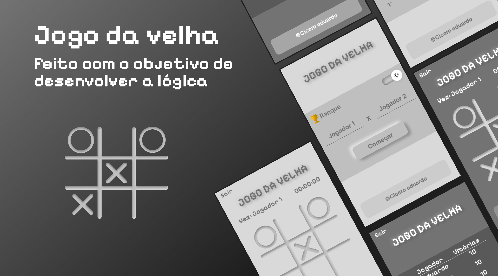
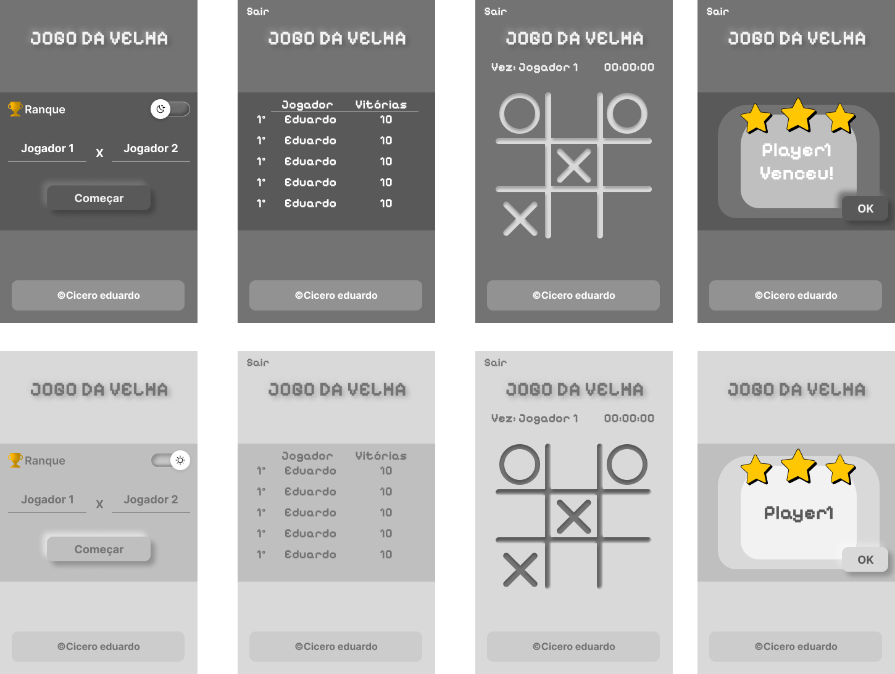

<h2 align="center">
	🎮Jogo da Velha
</h2>

<p align="center">
    <a href="#-sobre-o-projeto">Sobre</a> •
    <a href="#-layout">Layout</a> • 
    <a href="#-como-executar-o-projeto">Como executar</a> • 
    <a href="#-tecnologias">Tecnologias</a> •  
    <a href="#-autor">Autor</a>
</p>

## 💻 Sobre o projeto

O "Jogo da Velha Online" é uma versão clássica e interativa do jogo da velha, projetada para ser jogada diretamente no seu navegador. Desenvolvido com as linguagens HTML, CSS e JavaScript, o jogo oferece uma experiência simples e intuitiva.

<p align="center" style="display: flex; align-items: flex-start; justify-content: center;">
    
</p>

---

## 🎨 Layout

O projeto possui uma interface responsiva para variados dispositivos, além de poder escolher qual modo(claro ou escuro) é melhor para visualizar no momento.

<p align="center" style="display: flex; align-items: flex-start; justify-content: center;">
    
</p>

<h4 align="center"> 
    🌐 Exemplo para Mobile🌐
</h4>

---

## 📌 Como executar o projeto

#### ⏳ Pré-requisitos

Antes de começar, certifique-se de que você tenha  o [Git](https://git-scm.com) instalados em sua máquina.

#### 🧭 Baixando o projeto

```bash
# Clone este repositório
$ git clone git@github.com:CiceroEduardo84/tic-tac-toe.git
```

#### ⚙️ Executando o projeto

```bash
# Acesse o diretório
# Execute o arquivo index.html
```

---

## 🛠 Tecnologias

As seguintes ferramentas foram usadas na construção do projeto:

- **[HTML](https://developer.mozilla.org/pt-BR/docs/Learn/HTML)**
- **[CSS](https://developer.mozilla.org/pt-BR/docs/Learn/CSS)**
- **[JavaScript](https://developer.mozilla.org/pt-BR/docs/Learn/JavaScript)**

---

## 👩🏻‍💻 Autor

<p>
    <a href="https://github.com/CiceroEduardo84">
        
        <br />
        <b>Cicero Eduardo</b>
    </a>
</p>

[](https://www.linkedin.com/in/1-cicero-eduardo/)

---
